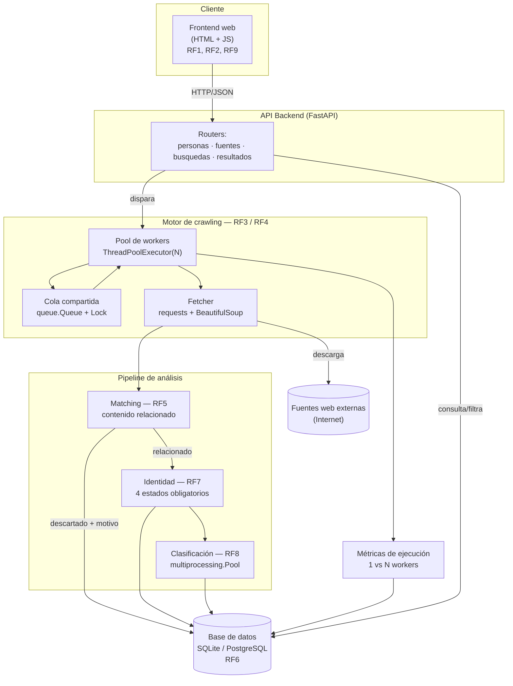

# Diagrama de arquitectura de software

Este diagrama se renderiza automáticamente en GitHub (formato Mermaid).

## Descripción de componentes

| Componente | Responsabilidad | RF relacionado |
|---|---|---|
| Frontend web | Registro de persona, administración de fuentes, disparo de búsquedas, consulta y filtrado de resultados | RF1, RF2, RF9 |
| API Backend (FastAPI) | Orquesta las solicitudes, valida datos, expone endpoints REST | Todos |
| Cola compartida | Estructura thread-safe que evita que una misma URL sea tomada por más de un worker a la vez | RF3, RF4 |
| Pool de workers | `ThreadPoolExecutor` configurable, procesa URLs concurrentemente | RF3 |
| Fetcher | Descarga HTML, extrae texto, enlaces y metadatos | RF3, RF6 |
| Matching | Determina si el contenido está relacionado con la persona consultada | RF5 |
| Identidad | Clasifica el nivel de correspondencia con la persona (4 estados) | RF7 |
| Clasificación contextual | Determina el tono del contenido relacionado con la persona (4 estados), paralelizado con `multiprocessing` | RF8 |
| Base de datos | Persistencia de personas, fuentes, búsquedas, URLs, documentos, verificaciones y métricas | RF6 |
| Métricas de ejecución | Registra tiempos por etapa para comparar 1 vs. N workers | Nota de medición |
