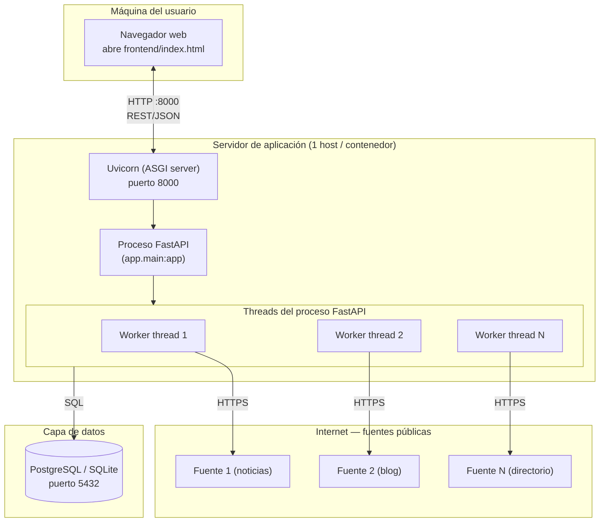

# Diagrama de infraestructura

## Notas de despliegue

- **Desarrollo local**: un solo proceso (`uvicorn app.main:app --reload`) con SQLite en un archivo local (`pepito.db`). Suficiente para el taller.
- **Despliegue con más carga**: separar la base de datos a PostgreSQL (variable `DATABASE_URL`), y considerar mover el crawling a un worker process independiente (ej. vía `multiprocessing` o una cola externa tipo Redis/Celery) si el volumen de búsquedas crece, para no bloquear el proceso web con crawls largos.
- **Escalado horizontal del crawler**: el número de threads del pool (`num_workers`) es configurable por búsqueda; en un entorno con más núcleos se puede subir sin cambiar código.
- **Frontend**: archivo estático (`frontend/index.html`), se puede servir con cualquier servidor HTTP simple o abrir directamente en el navegador, ya que consume la API vía `fetch` a `http://localhost:8000`.
