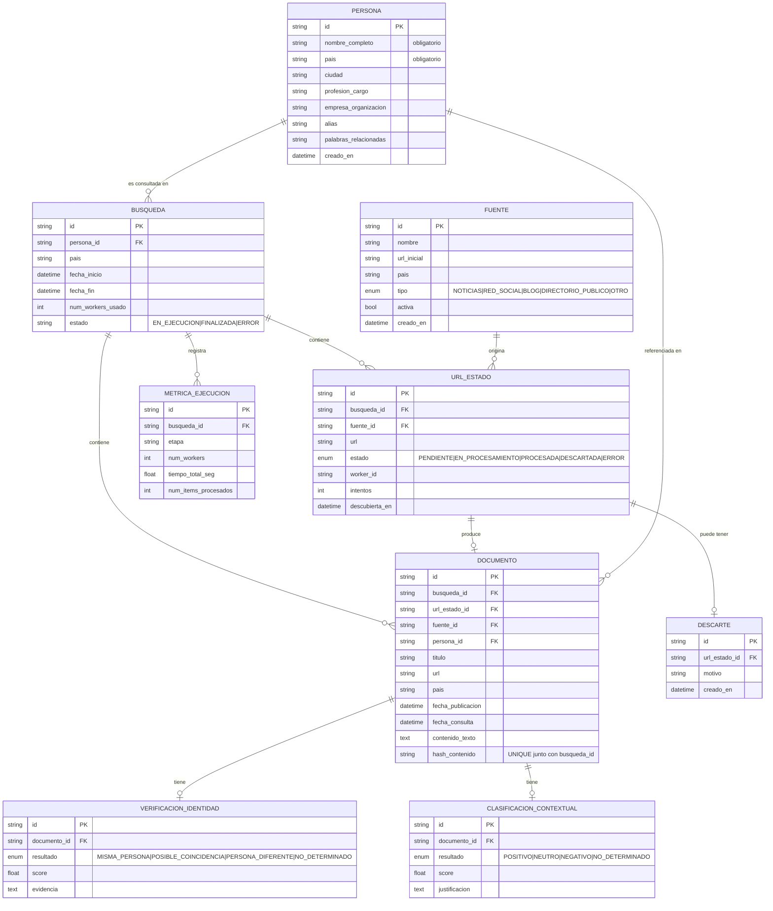

# Modelo de datos

Corresponde 1:1 con `backend/app/models.py`.

## Notas de diseño

- `UrlEstado` tiene una restricción `UNIQUE(busqueda_id, url)` — es la garantía a nivel de base de datos de que no se procesa la misma URL dos veces dentro de una búsqueda (RF4).
- `Documento` tiene una restricción `UNIQUE(busqueda_id, hash_contenido)` — evita persistir contenido duplicado dentro de la misma búsqueda (RF6), incluso si dos URLs distintas devuelven el mismo texto.
- `VerificacionIdentidad` y `ClasificacionContextual` usan tipos `Enum` a nivel de base de datos, por lo que es imposible insertar un valor fuera de los 4 estados obligatorios definidos por RF7 y RF8.
